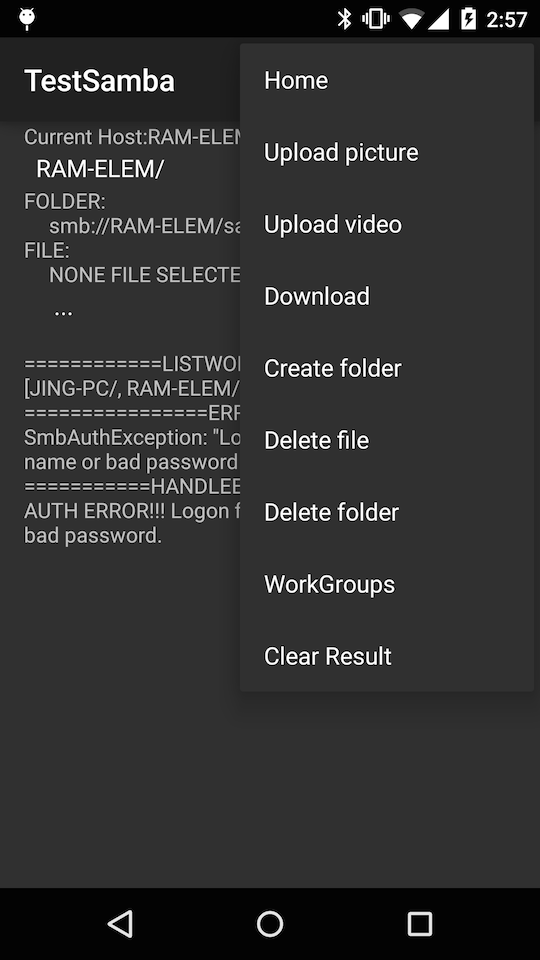
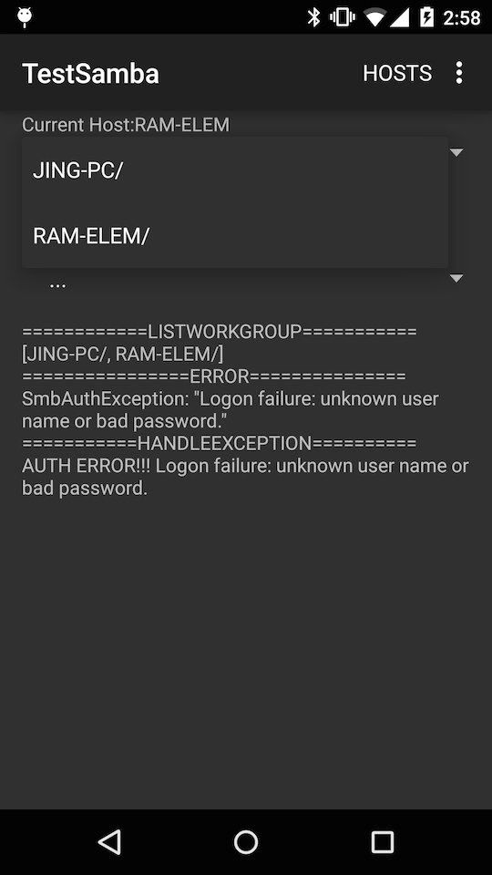
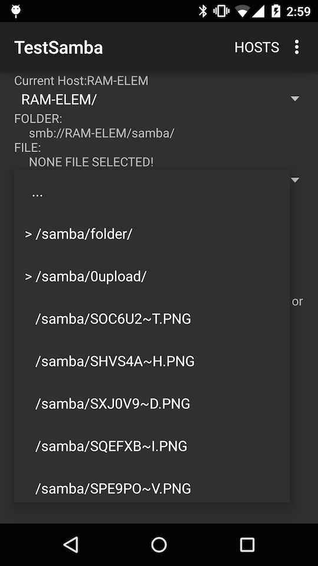
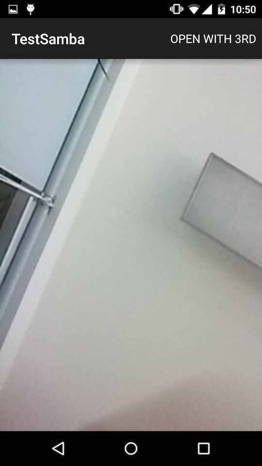
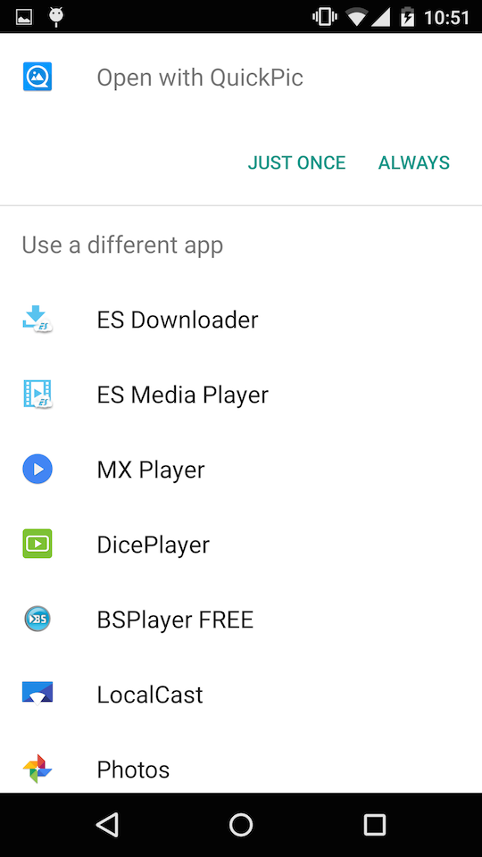
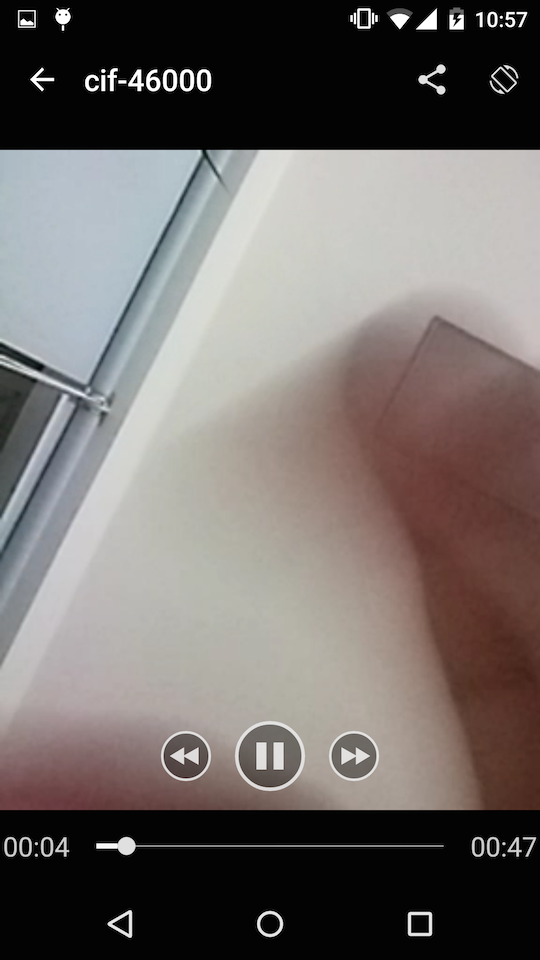

samba-nas
===

Samba-nas anims to explore remote file(s)/folder(s) in your NAS/samba server.

> - You can upload image/videos
> - You can create folders
> - You can Download files
> - You can delete file/folder
> - You can list all the work group in the same lan using NetBios
> - Playing video from SAMBA Share 
> - Playing video with 3rd app
> - Seeking is supported when playing video


Dependency
===
> - [JCIFS](https://jcifs.samba.org/)
> - [NanoHttpd](https://github.com/NanoHttpd/nanohttpd)
> - [microgramcaster](https://github.com/eriklupander/microgramcaster)

How to
===
Currently default VideoView can't play video through samba sharing.But can play http stream. So the solution i using is transfer SmbFileInputStream into http stream for videoview.

But there is a bug in NanoHttpd. That is when handling the header in NanoHttpd.Response the range is wrong.So I have to create an StreamResponse which extends NanoHttp.Response.And i override the `sendContentLengthHeaderIfNotAlreadyPresent` to handle it.

```java

        @Override
        protected void sendContentLengthHeaderIfNotAlreadyPresent(PrintWriter pw, Map<String, String> header, int size) {
            long pending = (getData() != null ? available : 0); // This is to support partial sends, see serveFile()
            String string = header.get("Content-Range"); // Such as bytes 203437551-205074073/205074074
            if (string != null) {
                if (string.startsWith("bytes ")) {
                    string = string.substring("bytes ".length());
                }
                Long start = Long.parseLong(string.split("-")[0]);
                pw.print("Content-Length: " + (pending - start) + "\r\n");
            } else {
                pw.print("Content-Length: " + pending + "\r\n");
            }
        }

```


And for the pending  NanoHttpd using is `available` , when playing a video whose size is bigger than 2GB will always get wrong.So i make `sendAsFixedLength()` to be a protected method and override it.


```java

        @Override
        protected void sendAsFixedLength(OutputStream outputStream, int pending) throws IOException {
            sendAsFixedLength(outputStream);
        }
        
        private void sendAsFixedLength(OutputStream outputStream) throws IOException {
            long pending = (getData() != null ? available : 0);
            if (getRequestMethod() != Method.HEAD && getData() != null) {
                int BUFFER_SIZE = 16 * 1024;
                byte[] buff = new byte[BUFFER_SIZE];
                while (pending > 0) {
                    // Note the ugly cast to int to support > 2gb files. If pending < BUFFER_SIZE we can safely cast anyway.
                    int read = getData().read(buff, 0, ((pending > BUFFER_SIZE) ? BUFFER_SIZE : (int) pending));
                    if (read <= 0) {
                        break;
                    }
                    outputStream.write(buff, 0, read);
                    pending -= read;
                }
            }
        }

``` 


# Images

> - #**Options**
> 
>  
>  
> - #**Workgroup** 
> 
>  
>  
> - #**Choose file/folder**
> 
>  
>  
> - #**Playing Video in Samba Sharing**
> 
>  
>  
> - #**Play Video with 3rd APP**
> 
>  
>   
> - #**Playing by QuickPic**
> 
>  
>  


# Me

> - WEIBO: [@hyongbai](http://weibo/hyongbai)
> - TWEET: [@hyongbai](http://twitter.com/hyongbai)
> - GMAIL: [hyongbai@gmail.com](mailto://hyongbai@gmail.com)
